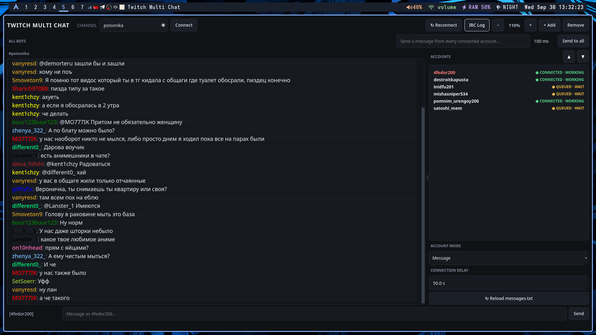
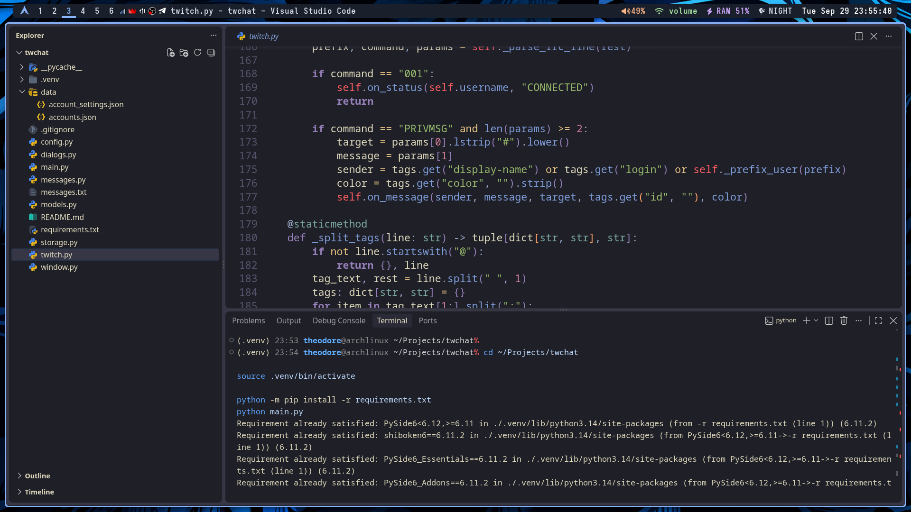

<div align="center">

# 🌿 Twitch Multi Chat 🌿

### A quieter way to manage a louder chat.


**One desktop app for several Twitch accounts, one channel, and fewer browser tabs.**

</div>

---

## 🍃 About

|:--|:--|
| **Platforms** | Windows · macOS · Linux |
| **Interface** | Python + PySide6 |
| **Connection** | Twitch IRC over TLS |
| **Twitch app registration** | Not required |

## 🖼️ Gallery

  
  

## 🌱 Features

- Manage multiple Twitch accounts from one window.
- Read a shared channel chat and send as the selected account.
- Broadcast one message from every connected account, with a configurable gap.
- Use per-account Flood Mode with randomized prepared messages and shared repeat protection.
- Inspect raw incoming and outgoing IRC activity; OAuth login commands are redacted in the log.
- Keep account settings and Flood history locally between launches.

## 🚀 Get started

**Requirements:** Python 3.13 or newer and an internet connection.

Clone the repository and enter its folder:

```bash
git clone https://github.com/TheodoreVAC/multi-twich-chat.git
cd multi-twich-chat
```

Create a virtual environment, install dependencies, and run the app using the commands for your operating system.

<details>
<summary><b>Windows · PowerShell</b></summary>

```powershell
py -3.13 -m venv .venv
.\.venv\Scripts\Activate.ps1
python -m pip install -r requirements.txt
python main.py
```

</details>

<details>
<summary><b>macOS · Linux</b></summary>

```bash
python3 -m venv .venv
source .venv/bin/activate
python -m pip install -r requirements.txt
python main.py
```

</details>

## 🟩 Connect an account

Add a Twitch username and an OAuth chat token with these scopes:

- `chat:read`
- `chat:edit`

Connect to a channel from the top bar. Account tokens are kept locally in `data/accounts.json`.

## 🍀 Broadcast & Flood

**Broadcast** sends the same text from each connected account. The gap is adjustable from 0 to 5000 ms; it starts at 100 ms.

**Flood Mode** reads `messages.txt` and sends enabled presets at a slower pace:

- Bundled presets wait 4–5 minutes between messages from the same account.
- Flood accounts have a shared minimum 15-second gap between sends.
- A preset is unavailable to every account for at least 5 hours after it is sent.
- History is saved in `data/flood_history.json`; if all eligible presets are cooling down, that account displays a warning and waits.

Presets can be assigned to all accounts with `accounts=*` or to selected logins with a comma-separated list:

```ini
[evening]
text=хороший стрим получился
cooldown=240
accounts=*
repeat_after=5h
enabled=true
```

Cooldowns use seconds by default; suffixes such as `5m` and `2h` are also supported. Repeat protection cannot be set below five hours.

## 🔒 Local data

The app creates `data/` automatically. It contains account tokens, per-account settings, and Flood history. These files are excluded from Git; tokens are stored as plain text, so keep the project directory private and never publish `data/accounts.json`.

---

<div align="center">

**Written with AI. You're on your own.** If it breaks, congrats: you found the next feature.

<sub>Green README. Dark UI. Questionable number of bots.</sub>

</div>
