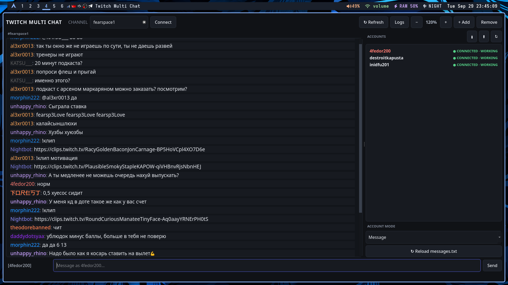

# Twitch Multi Chat

<p align="center">
  <strong>Modern multi-account Twitch chat client for Linux</strong><br>
  Manage multiple Twitch IRC accounts, switch between them instantly and automate prepared messages.
</p>

<p align="center">
  
  
  
  
</p>

---

## Preview

### Application



### Code


---

## Features

- Multiple Twitch accounts in one application
- Direct Twitch IRC connection over TLS
- Switch the active account with the mouse or `↑ / ↓`
- Send messages from the currently selected account
- Per-account `Message` and `Flood` modes
- Prepared messages loaded from `messages.txt`
- Random flood message selection
- Per-message cooldown and repeat protection
- Persistent flood history between launches
- Account connection status and reconnect handling
- Built-in logs for connections, messages and errors
- Adjustable interface scale
- Dark desktop-oriented interface
- No Twitch Developer Console application required

---

## Requirements

- Linux
- Python 3.13+
- `python3-venv`
- Internet connection
- Twitch account(s) with OAuth chat tokens

The project uses **PySide6** for the GUI and a direct **Twitch IRC** connection for chat.

---

## Installation

### 1. Clone the repository

```bash
git clone https://github.com/YOUR_USERNAME/twchat.git
cd twchat
```

### 2. Create a virtual environment

Arch Linux and other distributions may prevent installing packages into the system Python. Use a virtual environment:

```bash
python -m venv .venv
source .venv/bin/activate
```

### 3. Install dependencies

```bash
python -m pip install --upgrade pip
python -m pip install -r requirements.txt
```

### 4. Start the application

```bash
python main.py
```

Every next launch:

```bash
cd ~/Projects/twchat
source .venv/bin/activate
python main.py
```

---

## Arch Linux — complete setup

If Python or the virtual-environment module is missing:

```bash
sudo pacman -S python python-pip
```

Then:

```bash
cd ~/Projects/twchat
python -m venv .venv
source .venv/bin/activate
python -m pip install --upgrade pip
python -m pip install -r requirements.txt
python main.py
```

---

## Twitch OAuth tokens

Each account needs a Twitch OAuth token with chat permissions.

Required permissions:

- `chat:read`
- `chat:edit`

Enter the username and token through the account dialog in the application. Tokens are stored locally in `data/accounts.json`.

> **Security:** never commit `data/accounts.json` or publish your OAuth tokens. The `data/` directory is intentionally excluded from Git.

---

## Prepared messages

Prepared messages are stored in:

```text
messages.txt
```

Example:

```text
[hello]
text=Hello from Twitch Multi Chat!
cooldown=10
accounts=*
enabled=true
repeat_after=10800

[status]
text=Checking the channel status...
cooldown=30
accounts=bot1,bot2
enabled=true
repeat_after=10800
```

### Options

| Option | Description |
|---|---|
| `text` | Message that will be sent to Twitch |
| `cooldown` | Delay between flood messages for the account |
| `accounts` | `*` for every account or a comma-separated account list |
| `enabled` | Enables/disables the prepared message |
| `repeat_after` | Minimum time before the same prepared message can be selected again |

`repeat_after=10800` means **3 hours**.

---

## Flood mode

Each account has its own flood state.

When an account is switched to `Flood` mode, the application:

1. Loads enabled prepared messages.
2. Filters messages allowed for the selected account.
3. Removes messages that are still inside their `repeat_after` period.
4. Selects a message randomly.
5. Sends it through the account's Twitch IRC connection.
6. Records the send time in `data/flood_history.json`.
7. Waits for the configured cooldown before the next message.

Flood history survives application restarts.

---

## Project structure

```text
twchat/
├── main.py                 # Application entry point
├── config.py               # Paths and global configuration
├── models.py               # Data models
├── storage.py              # JSON persistence
├── messages.py             # messages.txt parser
├── twitch.py               # Twitch IRC client
├── dialogs.py              # Account dialog
├── window.py               # Main GUI
├── messages.txt            # Prepared messages
├── requirements.txt        # Python dependencies
├── README.md
├── .gitignore
├── screenshots/
│   ├── tmc.png             # Application preview
│   └── vsc.png             # Code preview
└── data/
    ├── accounts.json       # Local account tokens
    ├── account_settings.json
    └── flood_history.json
```

---

## Development

Activate the environment:

```bash
source .venv/bin/activate
```

Run directly:

```bash
python main.py
```

Check Python files for syntax errors:

```bash
python -m py_compile *.py
```

---

## Git setup

Initialize the repository:

```bash
git init
git add .
git commit -m "Initial commit"
```

Add your GitHub repository:

```bash
git branch -M main
git remote add origin https://github.com/YOUR_USERNAME/twchat.git
git push -u origin main
```

Make sure tokens are not tracked:

```bash
git status
```

The local `data/` directory should remain ignored.

---

## Updating

Pull the latest version:

```bash
cd ~/Projects/twchat
git pull
source .venv/bin/activate
python -m pip install -r requirements.txt
python main.py
```

Your local `data/` files remain separate from the source code.

---

## Troubleshooting

### `externally-managed-environment`

Create and activate the virtual environment before installing packages:

```bash
python -m venv .venv
source .venv/bin/activate
python -m pip install -r requirements.txt
```

### `ModuleNotFoundError: No module named 'PySide6'`

The virtual environment is probably not active:

```bash
source .venv/bin/activate
python -m pip install -r requirements.txt
python main.py
```

### Twitch account does not connect

Check:

- username is correct;
- OAuth token is valid;
- token contains `chat:read` and `chat:edit`;
- the machine has internet access;
- the Twitch channel name is entered without the `#` prefix.

Use the application's **Logs** window to inspect connection and IRC errors.

---

## License

Choose the license that matches your repository before publishing the project. For example, if you want a permissive open-source license, add a `LICENSE` file with the MIT license.

---

<p align="center">
  <sub>Built with Python, PySide6 and Twitch IRC.</sub>
</p>
